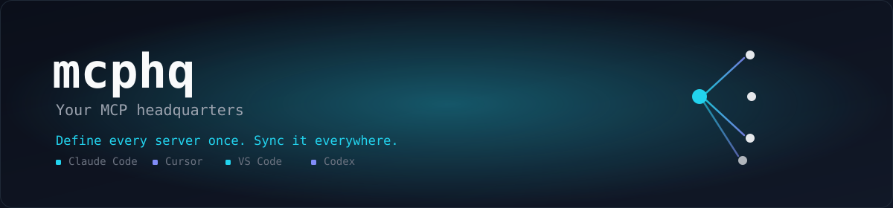

<div align="center">

# mcphq

<picture>
  <source media="(prefers-color-scheme: dark)" srcset="./.github/assets/banner-dark.svg">
  <source media="(prefers-color-scheme: light)" srcset="./.github/assets/banner-light.svg">
  
</picture>

<br />
<br />

[](./LICENSE)
[](https://bun.sh)
[](https://www.typescriptlang.org/)
[](https://biomejs.dev)
[](./CONTRIBUTING.md)
[](https://github.com/kumarpritam1468/mcphq/stargazers)
[](https://github.com/kumarpritam1468/mcphq/commits/main)
[](https://github.com/kumarpritam1468/mcphq/issues)

**[Quickstart](#quickstart)** · **[Commands](#commands)** · **[Supported Clients](#supported-clients)** · **[How It Works](#how-it-works)** · **[Roadmap](#roadmap)** · **[Contributing](./CONTRIBUTING.md)**

</div>

<br />

> **The problem in one sentence:** every AI coding tool invented its own place to store MCP server config — so adding one server means hand-editing Claude Code's JSON, Cursor's JSON, VS Code's JSON, and Codex's TOML, separately, forever, without any of them knowing the others exist.
>
> **mcphq is the fix.** Write the server definition once, in one file you actually control. Run `mcphq sync`. It's live in every client, in each client's own native format — and mcphq never touches anything it doesn't own.

<br />

## Features

- **One config, every client** — `mcp.config.json` is the only file you hand-edit. Everything else is generated.
- **Never clobbers what it doesn't own** — sync *upserts* only the servers you defined. Manually-added entries and unrelated client settings are left exactly as they are.
- **Drift detection** — `mcphq doctor` notices when a client config was hand-edited after the last sync, shows you exactly what changed field-by-field, and lets you decide: keep the hand-edit, restore from config, or skip. No silent overwrites, ever.
- **Safe by construction** — every write is backed up (`.mcphq-backup`), staged to a temp file, parsed back to confirm it's valid, then atomically renamed into place. A crash mid-write never corrupts your config.
- **Import what's already there** — already have servers configured by hand in Claude Code or Cursor? `mcphq import` pulls them into `mcp.config.json` so you stop maintaining duplicates.
- **Zero-surprise dry runs** — `--dry-run` on every mutating command shows the exact diff before anything touches disk.

## Supported Clients

| Client | Format | Status |
|---|---|---|
| **Claude Code** | JSON (`~/.claude.json`, `.mcp.json`) | ✅ Supported |
| **Cursor** | JSON | ✅ Supported |
| **VS Code** (GitHub Copilot) | JSON | ✅ Supported |
| **Codex CLI** | TOML | ✅ Supported |

`sync --dry-run` always prints the exact file paths it targets before writing anything. VS Code sync targets the default user profile and the current workspace; named VS Code profiles aren't supported yet.

Adding a new client is one file — see [Contributing](./CONTRIBUTING.md).

## Quickstart

**Prerequisite:** [Bun](https://bun.sh) 1.3+.

```bash
git clone https://github.com/kumarpritam1468/mcphq.git
cd mcphq
bun install
```

Create your source-of-truth config:

```bash
bun run mcphq -- init
```

This walks you through adding your first server interactively. Prefer to skip straight to editing a file? `mcphq init --no-input` writes an empty config instead — then add servers by hand:

```json
{
  "servers": {
    "context7": {
      "command": "npx",
      "args": ["-y", "@upstash/context7-mcp"]
    }
  }
}
```

Preview what would change, then push it everywhere:

```bash
bun run mcphq -- sync --dry-run   # see the exact diff, nothing is written
bun run mcphq -- sync             # write it to every detected client
```

That's it — the server is now configured in every AI client on your machine, in each client's own native format.

## Commands

| Command | What it does |
|---|---|
| `mcphq init` | Create `mcp.config.json`, interactively or with `--no-input` |
| `mcphq sync` | Push `mcp.config.json` into every detected client. `--dry-run` to preview, `--force` to accept all overwrites, `--no-input` for CI |
| `mcphq list` | Show every configured server and which clients it's synced to |
| `mcphq doctor` | Detect drift since the last sync and reconcile it (keep-theirs / keep-mine / skip), server by server |
| `mcphq remove <server>` | Remove a server from `mcp.config.json` and every synced client |
| `mcphq import` | Pull servers already hand-configured in a detected client into `mcp.config.json`. `--global` targets the global config, `--force` to overwrite conflicts |

Run any command with `--help` for the full flag list.

## How It Works

- **`mcp.config.json`** is validated with Zod and expanded into a canonical `McpServer` shape shared by every adapter.
- **Adapters** (`packages/core/src/adapters/`) know how to read and write one specific client's config format. Each one **upserts only the servers mcphq owns** — it never removes a manually-added entry or touches unrelated keys in your config.
- **`mcphq.lock.json`** records a content hash of what was last synced to each client, per server. `mcphq doctor` compares the client's current state against it to catch hand-edits — no more silently-diverging configs nobody notices until something breaks.
- **Every write is atomic**: backup → write to temp file → parse the temp file to confirm it's valid → rename over the original. A crash mid-write leaves your original file untouched.

## Roadmap

mcphq is under active development. Shipped so far:

- [x] `init` / `sync` — canonical config, multi-client sync, safe atomic writes
- [x] `list` / `remove` / `import` — full config lifecycle without hand-editing client files
- [x] `doctor` — drift detection against a lockfile, with keep-theirs/keep-mine reconciliation

Coming next:

- [ ] `mcphq add <server>` — look up a server in the MCP Registry, show publisher trust info, then add + sync
- [ ] Static security checks — flag suspicious env access, destructive command patterns, unverified publishers
- [ ] Compiled binaries + `npx mcphq` — no Bun install required
- [ ] CI across Windows/macOS/Linux

## Contributing

Contributions are very welcome — this is an early-stage project and there's real design space left, especially around new client adapters and the security-checking track. See **[CONTRIBUTING.md](./CONTRIBUTING.md)** for setup, the one-file adapter pitch, and how to open a good PR. Please also read our **[Code of Conduct](./CODE_OF_CONDUCT.md)**.

Found a security issue? Please don't open a public issue — see **[SECURITY.md](./SECURITY.md)**.

## Founders

Built and maintained by:

- **Pritam Kumar Manohari** — [@kumarpritam1468](https://github.com/kumarpritam1468)
- **Sujal Kumar Ghosh** — [@SujalKrG](https://github.com/SujalKrG)

## License

MIT © 2026 Pritam Kumar Manohari and Sujal Kumar Ghosh — see [LICENSE](./LICENSE).
